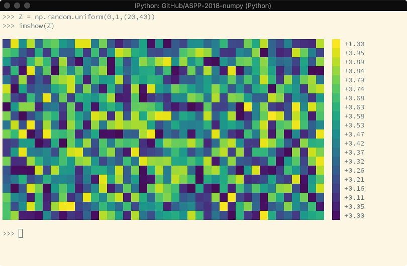
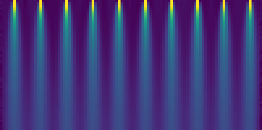
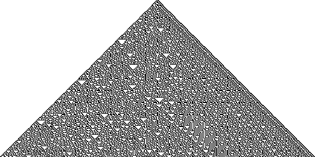
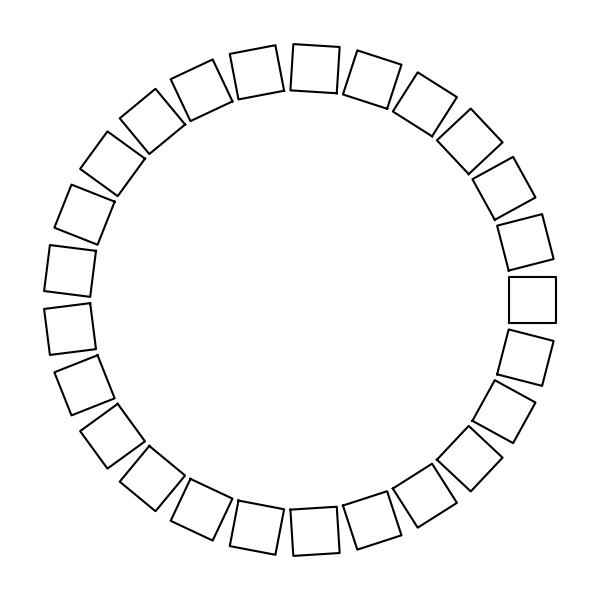

# Advanced NumPy

A 3h00 course on advanced numpy techniques  
[Nicolas P. Rougier](http://www.labri.fr/perso/nrougier), [G-Node summer school](https://python.g-node.org/), Camerino, Italy, 2018

> NumPy is a library for the Python programming language, adding support for
> large, multi-dimensional arrays and matrices, along with a large collection of
> high-level mathematical functions to operate on these arrays.
>
> – Wikipedia

**Quicklinks**: [Numpy website](https://www.numpy.org) – [Numpy GitHub](https://github.com/numpy/numpy) – [Numpy documentation](https://www.numpy.org/devdocs/reference/) – [ASPP archives](https://python.g-node.org/wiki/archives)


**Table of Contents**:

* [Introduction](#--introduction)
* [Warmup](#--warmup)
* [Advanced exercises](#--advanced-exercises)
* [References](#--references)

---

## ❶ – Introduction

NumPy is all about vectorization. If you are familiar with Python, this is the
main difficulty you'll face because you'll need to change your way of thinking
and your new friends (among others) are named "vectors", "arrays", "views" or
"ufuncs". Let's take a very simple example: random walk.

One obvious way to write a random walk in Python is:

```Python
def random_walk_slow(n):
    position = 0
    walk = [position]
    for i in range(n):
        position += 2*random.randint(0, 1)-1
        walk.append(position)
    return walk
walk = random_walk_slow(1000)
```


It works, but it is slow. We can do better using the itertools Python module
that offers a set of functions for creating iterators for efficient looping. If
we observe that a random walk is an accumulation of steps, we can rewrite the
function by first generating all the steps and accumulate them without any
loop:

```Python
def random_walk_faster(n=1000):
    from itertools import accumulate
    # Only available from Python 3.6
    steps = random.choices([-1,+1], k=n)
    return [0]+list(accumulate(steps))
walk = random_walk_faster(1000)
```

It is better but still, it is slow. A more efficient implementation, taking
full advantage of NumPy, can be written as:

```Python
def random_walk_fastest(n=1000):
    steps = np.random.choice([-1,+1], n)
    return np.cumsum(steps)
walk = random_walk_fastest(1000)
```

Now, it is amazingly fast !


Before heading to the course, I would like to warn you about a potential
problem you may encounter once you'll have become familiar with NumPy. It is a
very powerful library and you can make wonders with it but, most of the time,
this comes at the price of readability. If you don't comment your code at the
time of writing, you won't be able to tell what a function is doing after a few
weeks (or possibly days). For example, can you tell what the two functions
below are doing?

```Python
def function_1(seq, sub):
    return [i for i in range(len(seq) - len(sub)) if seq[i:i+len(sub)] == sub]

def function_2(seq, sub):
    target = np.dot(sub, sub)
    candidates = np.where(np.correlate(seq, sub, mode='valid') == target)[0]
    check = candidates[:, np.newaxis] + np.arange(len(sub))
    mask = np.all((np.take(seq, check) == sub), axis=-1)
    return candidates[mask]
```


As you may have guessed, the second function is the
vectorized-optimized-faster-NumPy version of the first function and it runs 10x
faster than the pure Python version. But it is hardly readable.

Last, but not least, you may have noticed the the `random_walk_fast` works but
is not reproducible at all, which is pretty annoying. If you want to know why,
you can have a look at the article [Re-run, Repeat, Reproduce, Reuse,
Replicate: Transforming Code into Scientific
Contributions](https://www.frontiersin.org/articles/10.3389/fninf.2017.00069/full).


## ❷ – Warmup

You're supposed to be already familiar with NumPy. If not, you should read the
[NumPy chapter](http://www.scipy-lectures.org/intro/numpy/index.html) from the [SciPy Lecture Notes](http://www.scipy-lectures.org/). Before heading to the more advanced
stuff, let's do some warmup exercises (that should pose no problem). If you
choke on the first exercise, you should try to have a look at the [Anatomy of an array](https://www.labri.fr/perso/nrougier/from-python-to-numpy/#anatomy-of-an-array) and check also the [Quick references](https://www.labri.fr/perso/nrougier/from-python-to-numpy/#quick-references).

### Useful tools

Before heading to the exercises, you might want to play with the [tools.py](tools.py) file
that offer a set of debug tools that might be (hopefully) useful in your
day-to-day computational scientific life.

```Pycon
>>> from tools import sysinfo, info, timeit, imshow

>>> sysinfo()
Date:       08/25/18
Python:     3.7.0
Numpy:      1.14.5
Scipy:      1.1.0
Matplotlib: 2.2.2

>>> Z = np.arange(10)
>>> info(Z)
------------------------------
Interface (item)
  shape:       (10,)
  dtype:       int64
  size:        10
  order:       ☑ C  ☐ Fortran

Memory (byte)
  item size:   8
  array size:  80
  strides:     (8,)

Properties
  own data:    ☑ Yes  ☐ No
  writeable:   ☑ Yes  ☐ No
  contiguous:  ☑ Yes  ☐ No
  aligned:     ☑ Yes  ☐ No
------------------------------

>>> timeit("Z=np.random.uniform(0,1,1000000)", globals())
11.4 ms ± 0.198 ms per loop (mean ± std. dev. of 7 runs, 100 loops each)
```

Last, but not least, there is also an `imshow` function that is able to display a
one-dimensional or two-dimensional array in the console. It won't replace matplotlib but it can comes handy for some small arrays:




### Basic manipulation

• Create a vector with values ranging from 10 to 49  
• Create a null vector of size 100 but the fifth value which is 1  
• Reverse a vector (first element becomes last)  
• Create a 3x3 matrix with values ranging from 0 to 8  
• Create a 3x3 identity matrix  
• Create a 2d array with 1 on the border and 0 inside   
• Given a 1D array, negate all elements which are between 3 and 8, in place  

For a more complete list, you can have a look at the [100 Numpy Exercises](https://github.com/rougier/numpy-100).

<details><summary><b>Solution</b> (click to expand)</summary><p>

Sources: [basic-manipulation.py](basic-manipulation.py)

```Python
import numpy as np

# Create a vector with values ranging from 10 to 49
Z = np.arange(10,50)

# Create a null vector of size 100 but the fifth value which is 1
Z = np.zeros(100)
Z[4] = 1

# Reverse a vector (first element becomes last)
Z = np.arange(50)[::-1]

# Create a 3x3 matrix with values ranging from 0 to 8
Z = np.arange(9).reshape(3,3)

# Create a 3x3 identity matrix
Z = np.eye(3)

# Create a 2d array with 1 on the border and 0 inside
Z = np.ones((10,10))
Z[1:-1,1:-1] = 0

# Given a 1D array, negate all elements which are between 3 and 8, in place
Z = np.arange(11)
Z[(3 < Z) & (Z <= 8)] *= -1`
```
</p></details>


### NaN arithmetics

What is the result of the following expression?  
**→ Hints**: [What Every Computer Scientist Should Know About Floating-Point Arithmetic, D. Goldberg, 1991](https://docs.oracle.com/cd/E19957-01/806-3568/ncg_goldberg.html)  

```Python
print(0 * np.nan)
print(np.nan == np.nan)
print(np.inf > np.nan)
print(np.nan - np.nan)
print(0.3 == 3 * 0.1)
```


<details><summary><b>Solution</b> (click to expand)</summary><p>

Sources [nan-arithmetics.py](nan-arithmetics.py)

```Python
import numpy as np

# Result is NaN
print(0 * np.nan)

# Result is False
print(np.nan == np.nan)

# Result is False
print(np.inf > np.nan)

# Result is NaN
print(np.nan - np.nan)

# Result is False !!!
print(0.3 == 3 * 0.1)
```

</p></details>

### Computing strides

Consider an array Z, how to compute Z strides (manually)?  
**→ Hints**: [itemsize](https://docs.scipy.org/doc/numpy/reference/generated/numpy.ndarray.itemsize.html) – [shape](https://docs.scipy.org/doc/numpy/reference/generated/numpy.ndarray.shape.html) – [ndim](https://docs.scipy.org/doc/numpy/reference/generated/numpy.ndarray.ndim.html)  


```Python
import numpy as np
Z = np.arange(24).reshape(2,3,4)
print(Z.strides)
```

<details><summary><b>Solution</b> (click to expand)</summary><p>

Sources [compute-strides.py](compute-strides.py)

```Python
import numpy as np

def compute_strides(Z):
    strides = [Z.itemsize]
    for i in range(Z.ndim-1,0,-1):
        strides.append(strides[-1] * Z.shape[i])
    return tuple(strides[::-1])

# This work
Z = np.arange(24).reshape(2,3,4)
print(Z.strides, " – ", compute_strides(Z))

# This does not work
# Z = Z[::2]
# print(Z.strides, " – ", compute_strides(Z))
```

</p></details>

### Repeat and repeat

Can you tell the difference?  
**→ Hints**: [tile](https://docs.scipy.org/doc/numpy/reference/generated/numpy.tile.html) – [as_strided](https://docs.scipy.org/doc/numpy-1.13.0/reference/generated/numpy.lib.stride_tricks.as_strided.html)  

```Python
import numpy as np
from numpy.lib.stride_tricks import as_strided

Z = np.random.randint(0,10,5)
Z1 = np.tile(Z, (3,1))
Z2 = as_strided(Z, shape=(3,)+Z.shape, strides=(0,)+Z.strides)
```

<details><summary><b>Solution</b> (click to expand)</summary><p>

Sources [repeat.py](repeat.py)

```Python
import numpy as np
from numpy.lib.stride_tricks import as_strided

Z = np.zeros(5)
Z1 = np.tile(Z,(3,1))
Z2 = as_strided(Z, shape=(3,)+Z.shape, strides=(0,)+Z.strides)

# Real repeat: three times the memory
Z1[0,0] = 1
print(Z1)

# Fake repeat: less memory but not totally equivalent
Z2[0,0] = 1
print(Z2)
```

</p></details>

### Heat equation

 
> The diffusion equation (a.k.a the heat equation) reads `∂u/∂t = α∂²u/∂x²` where
> u(x,t) is the unknown function to be solved, x is a coordinate in space, and t
> is time. The coefficient α is the diffusion coefficient and determines how fast
> u changes in time. The discrete (time(n) and space (i)) version of the equation
> can be rewritten as `u(i,n+1) = u(i,n) + F(u(i-1,n) - 2u(i,n) + u(i+1,n))`.
>
> – [Finite difference methods for diffusion processes](http://hplgit.github.io/num-methods-for-PDEs/doc/pub/diffu/sphinx/._main_diffu000.html), Hans Petter Langtangen

The goal here is to compute the discrete equation over a finite domain using
`as_strided` to produce a sliding-window view of a 1D array. This view can be
then used to compute `u` at the next iteration. Using the the following initial
conditions:

```Python
U = np.random.uniform(0.00, 0.05, (50,100))
U[0,5::10] = 1
```

Try to obtain this picture (where time goes from top to bottom):




<details><summary><b>Solution</b> (click to expand)</summary><p>

Sources [diffusion.py](diffusion.py)

```Python
import numpy as np
import matplotlib.pyplot as plt
from numpy.lib.stride_tricks import as_strided


def sliding_window(Z, size=2):
    n, s = Z.shape[0], Z.strides[0]
    return as_strided(Z, shape=(n-size+1, size), strides=(s, s))


# Initial conditions:
# Domain size is 100 and we'll iterate over 50 time steps
U = np.zeros((50,100))
U[0,5::10] = 1.5

# Actual iteration
F = 0.05
for i in range(1, len(Z)):
    Z[i,1:-1] = Z[i-1,1:-1] + F*(sliding_window(Z[i-1], 3)*[+1,-2,+1]).sum(axis=1)

# Display
plt.figure(figsize=(6,3))
plt.subplot(1,1,1,frameon=False)
plt.imshow(Z, vmin=0, vmax=1)
plt.xticks([]), plt.yticks([])
plt.tight_layout()
plt.savefig("diffusion.png")
plt.show()
```

</p></details>


### Rule 30

With only a slight modification of the previous exercise, we can compute a
one-dimensional [cellular automata](https://en.wikipedia.org/wiki/Cellular_automaton) and more specifically the [Rule 30](https://en.wikipedia.org/wiki/Rule_30) that
exhibits intriguing patterns as shown below:



To start with, here is how to convert the rule in a useful form:

```Python
rule = 30 
R = np.array([int(v) for v in '{0:08b}'.format(rule)])[::-1]
```

<details><summary><b>Solution</b> (click to expand)</summary><p>

Sources [automata.py](automata.py)

```Python
import numpy as np
import matplotlib.pyplot as plt
from numpy.lib.stride_tricks import as_strided

def sliding_window(Z, size=2):
    n, s = Z.shape[0], Z.strides[0]
    return as_strided(Z, shape=(n-size+1, size), strides=(s, s))

# Rule 30  (see https://en.wikipedia.org/wiki/Rule_30)
# 0x000: 0, 0x001: 1, 0x010: 1, 0x011: 1
# 0x100: 1, 0x101: 0, 0x110: 0, 0x111: 0
rule = 30 
R = np.array([int(v) for v in '{0:08b}'.format(rule)])[::-1]

# Initial state
Z = np.zeros((250,501), dtype=int)
Z[0,250] = 1

# Computing some iterations
for i in range(1, len(Z)):
    N = sliding_window(Z[i-1],3) * [1,2,4]
    Z[i,1:-1] = R[N.sum(axis=1)]

# Display
plt.figure(figsize=(6,3))
plt.subplot(1,1,1,frameon=False)
plt.imshow(Z, vmin=0, vmax=1, cmap=plt.cm.gray_r)
plt.xticks([]), plt.yticks([])
plt.tight_layout()
plt.savefig("automata.png")
plt.show()
```

</p></details>

## ❸ – Advanced exercises

### Geometry

We consider a collection of 2d squares that are each defined by four points, a scaling factor, a translation and a rotation angle. We want to obtain the following figure:



made of 25 squares, scaled by 0.1, translated by (1,0) and with increasing
rotation angles. The order of operation is `scale`, `translate` and
`rotate`. What would be the best structure `S` to hold all these information at
once?  
**→  Hints**: [structured arrays](https://docs.scipy.org/doc/numpy/user/basics.rec.html)
<details><summary><b>Solution</b> (click to expand)</summary><p>

```Python
dtype = [("points",    float, (4, 2)),
         ("scale",     float, 1),
         ("translate", float, 2),
         ("rotate",    float, 1)]
S = np.zeros(25, dtype = dtype)
```

</p></details><br/>

Now, we need to write a function that apply all these transformations and write
the results in new array:

```Python

P = np.zeros((len(S), 4, 2))
# Your code here (to populate P)
...
```

<details><summary><b>Solution</b> (click to expand)</summary><p>

Source: [geometry.py](geometry.py)

```Python
import numpy as np
import matplotlib.pyplot as plt

dtype = [("points",    float, (4, 2)),
         ("scale",     float, 1),
         ("translate", float, 2),
         ("rotate",    float, 1)]
S = np.zeros(25, dtype = dtype)
S["points"] = [(-1,-1), (-1,+1), (+1,+1), (+1,-1)]
S["translate"] = (1,0)
S["scale"] = 0.1
S["rotate"] = np.linspace(0, 2*np.pi, len(S), endpoint=False)

P = np.zeros((len(S), 4, 2))
for i in range(len(S)):
    for j in range(4):
        x = S[i]["points"][j,0]
        y = S[i]["points"][j,1]
        tx, ty = S[i]["translate"]
        scale  = S[i]["scale"]
        theta  = S[i]["rotate"]
        x = tx + x*scale
        y = ty + y*scale
        x_ = x*np.cos(theta) - y*np.sin(theta)
        y_ = x*np.sin(theta) + y*np.cos(theta)
        P[i,j] = x_, y_

fig = plt.figure(figsize=(6,6))
ax = plt.subplot(1,1,1, frameon=False)
for i in range(len(P)):
    X = np.r_[P[i,:,0], P[i,0,0]]
    Y = np.r_[P[i,:,1], P[i,0,1]]
    plt.plot(X, Y, color="black")
plt.xticks([]), plt.yticks([])
plt.tight_layout()
plt.savefig("geometry.png")
plt.show()
```

</p></details><br/>

The proposed solution has two loops. Can you imagine a way to do it without loop ?  
**→ Hints**: [einsum](https://docs.scipy.org/doc/numpy/reference/generated/numpy.einsum.html)

<details><summary><b>Solution</b> (click to expand)</summary><p>

Have a look at [Multiple individual 2d rotation at once](https://stackoverflow.com/questions/40822983/multiple-individual-2d-rotation-at-once) on stack overflow. I did not implement it, feel free to issue a PR with the solution.

</p></details>

### Neural networks

In this exercise, we'll implement one of the most simple feed-forward neural
network, a.k.a. the [Perceptron](https://en.wikipedia.org/wiki/Perceptron). We'll use it to discrimate between two classes
(points in two dimensions,see [desired output](perceptron.mp4)):

```Python
samples = np.zeros(100, dtype=[('input',  float, 2),
                               ('output', float, 1)])
                               
P = np.random.uniform(0.05,0.95,(len(samples),2))
samples["input"] = P
stars = np.where(P[:,0]+P[:,1] < 1)
discs = np.where(P[:,0]+P[:,1] > 1)
samples["output"][stars] = +1
samples["output"][discs] = 0
```

Your goal is to populate the following class in order to train the
network. You'll need:

* a one-dimensional array to store the input
* a one-dimensional array to store the output
* a two-dimensional array to store the weights
* a threshold function (for example `lambda x: x > 0`)

The `propagate_forward` method is supposed to compute the output of the network
while the `propagate_backward` is supposed to modify the weights according to
the actual error.

```Python
class Perceptron:
    def __init__(self, n, m):
        "Initialization of the perceptron with given sizes"
        ...

    def reset(self):
        "Reset weights"
        ...

    def propagate_forward(self, data):
        "Propagate data from input layer to output layer"
        ...
        
    def propagate_backward(self, target, lrate=0.1):
        "Back propagate error related to target using lrate"
        ... 
```

<details><summary><b>Solution</b> (click to expand)</summary><p>

Sources: [perceptron.py](perceptron.py)

```Python
class Perceptron:
    ''' Perceptron class. '''

    def __init__(self, n, m):
        "Initialization of the perceptron with given sizes"

        self.input  = np.ones(n+1)
        self.output = np.ones(m)
        self.weights= np.zeros((m,n+1))
        self.reset()

    def reset(self):
        "Reset weights"

        self.weights[...] = np.random.uniform(-.5, .5, self.weights.shape)

    def propagate_forward(self, data):
        "Propagate data from input layer to output layer"

        # Set input layer (but not bias)
        self.input[1:]  = data
        self.output[...] = f(np.dot(self.weights,self.input))

        # Return output
        return self.output

    def propagate_backward(self, target, lrate=0.1):
        "Back propagate error related to target using lrate"

        error = np.atleast_2d(target-self.output)
        input = np.atleast_2d(self.input)
        self.weights += lrate*np.dot(error.T,input)

        # Return error
        return (error**2).sum()
```

</p></details><br/>

To train the network for 1000 iterations, we can do:

```Python

lrate = 0.1
for i in range(1000):
    lrate *= 0.999
    n = np.random.randint(samples.size)
    network.propagate_forward( samples['input'][n] )
    error = network.propagate_backward( samples['output'][n], lrate )
```

For other type of neural networks, you can have a look at https://github.com/rougier/neural-networks/.


## ❹ – References

### Book & tutorials

This is a curated list of resources among the plethora of books & tutorials
that exist online.

* [From Python to Numpy](http://www.labri.fr/perso/nrougier/from-python-to-numpy/),
  Nicolas P.Rougier, 2017
* [100 Numpy Exercises](https://github.com/rougier/numpy-100),
  Nicolas P. Rougier, 2017
* [SciPy Lecture Notes](http://www.scipy-lectures.org/),
  Gaël Varoquaux, Emmanuelle Gouillart, Olav Vahtras et al., 2016
* [Elegant SciPy: The Art of Scientific Python](https://github.com/elegant-scipy/elegant-scipy),
  Juan Nunez-Iglesias, Stéfan van der Walt, Harriet Dashnow, 2016
* [Numpy Medkit](http://mentat.za.net/numpy/numpy_advanced_slides),
  Stéfan van der Walt, 2008

### Archives

You can access all ASPP archives from https://python.g-node.org/wiki/archives

* **2017** (Nikiti, Greece, Juan Nunez-Iglesias):
  [exercises](https://github.com/jni/aspp2017-numpy) –  [solutions](https://github.com/jni/aspp2017-numpy-solutions)
* **2016** (Reading, United Kingdom, Stéfan van der Walt):
  [exercises](https://github.com/ASPP/2016_numpy)
* **2015** (Munich, Germany, Juan Nunez-Iglesias):
  [exercises](https://github.com/jni/aspp2015/tree/delivered) – [solutions](https://github.com/jni/aspp2015/tree/solved-in-class)
* **2014** (Split, Croatia, Stéfan van der Walt):
  [notebooks](https://python.g-node.org/python-summerschool-2014/_media/numpy_advanced.tar.bz2)
* **2013** (Züricj, Switzerland, Stéfan van der Walt):
  [slides](https://python.g-node.org/python-summerschool-2013/_media/advanced_numpy/slides/index.html) – [exercises](https://python.g-node.org/python-summerschool-2013/_media/advanced_numpy/problems.html) – [dropbox](https://www.dropbox.com/sh/4esl1ii7cac5xfa/O-CSFKKYvS/assp2013/numpy_problems)
* **2012** (Kiel, Germany, Stéfan van der Walt):
  [slides](https://python.g-node.org/python-summerschool-2012/_media/wiki/numpy/numpy_kiel2012.pdf) – [exercises](https://python.g-node.org/python-summerschool-2012/_media/wiki/numpy/problems.html)
* **2011** (St Andrew, United Kingdom, Pauli Virtanen):
  [slides](https://python.g-node.org/python-summerschool-2011/_media/materials/numpy/numpy-slides.pdf) – [exercises](https://python.g-node.org/python-summerschool-2011/_media/materials/numpy/numpy-exercises.zip) – [solutions](https://python.g-node.org/python-summerschool-2011/_media/materials/numpy/numpy-solutions.zip)
* **2010** (Trento, Italy, Stéfan van der Walt):
  [slides](https://python.g-node.org/python-autumnschool-2010/_media/materials/advanced_numpy/numpy_trento2010.pdf) – [exercises](https://python.g-node.org/python-autumnschool-2010/_media/materials/advanced_numpy/problems.html) – [solutions 1](https://python.g-node.org/python-autumnschool-2010/_media/materials/advanced_numpy/array_interface/solution.py) – [solutions 2](https://python.g-node.org/python-autumnschool-2010/_media/materials/advanced_numpy/structured_arrays/load_txt_solution.py)
* **2010** (Warsaw, Poland, Bartosz Teleńczuk):
  [slides](https://python.g-node.org/python-winterschool-2010/_media/scientific_python.pdf) – [exercises](https://python.g-node.org/python-winterschool-2010/_media/python_tools_for_science.pdf)
* **2009** (Berlin, Germany, Jens Kremkow):
  [slides](https://python.g-node.org/python-summerschool-2009/_media/numpy_scipy_matplotlib_pynn_neurotools.pdf) – [examples](https://python.g-node.org/python-summerschool-2009/_media/examples_numpy.py) – [exercises](https://python.g-node.org/python-summerschool-2009/_media/exercises_day2_numpy.py)
